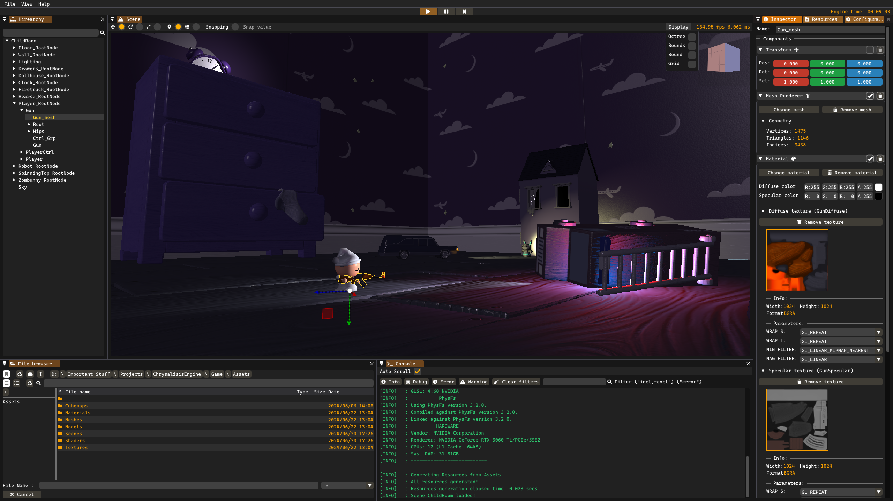
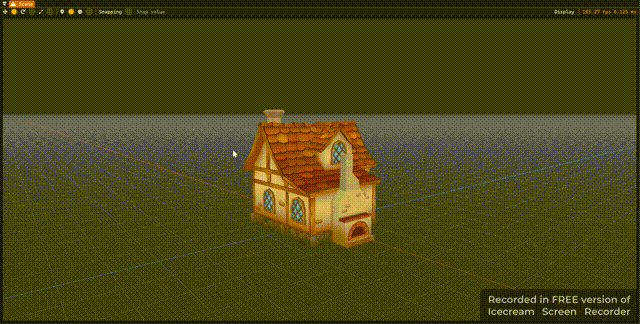
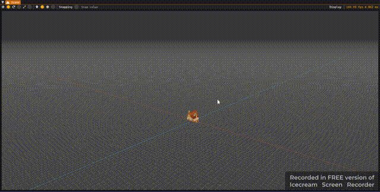
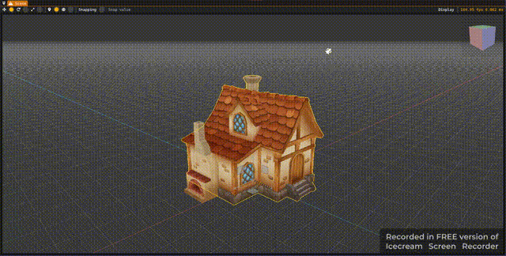

# ChrysalisisEngine

3D Game engine made with C++ & OpenGL, created and developed by [Miquel Prieto Moliné](https://github.com/MacXxs)
 
You can check the repo [here](https://github.com/MacXxs/ChrysalisisEngine_PublicRelease)
 

## Table of Contents
- [How to use](#how-to-use)      
</t> 1. [Camera Controls](#camera-controls)  
</t> 2. [Scene Managament](#scene-managament)  
</t> 3. [Menu Layout](#menu-layout) 
- [Features](#features)
- [Help](#help)

## How to use
### Camera Controls
- Use the "WASD" keys and move the mouse while right clicking to move around in a FPS-fashion way and look around. 

- Use the "QE" keys while right clicking to go up and down the scene. 

- Holding down "LSHIFT" accelerates the movement velocity. 

- Press "F" to focus the camera around the loaded model. 

- Hold "L_ALT" + right click to zoom in/out while moving the mouse. 

- Hold "L_ALT" + left click to orbit around a loded model using the mouse. 

### Scene Managament
- Load a model by drag&dropping it to the scene.
- Use QWE to change between translation, rotation & scaling modes.
- Use Z to change between local and global coordiates mode.
- Use X to toggle snapping ON/OFF.
- Create a new scene, load one or save the changes using the desired option in the <i>File</i> menu tab in the main menu bar.

### Menu Layout
- File
  - New scene
  - Load
  - Save
  - Save as 
  - Quit
- View
  - Scene
  - Hirearchy
  - Inspector
  - Configuration
  - Resources
  - File browser
  - Console
- Help
  - Repo
  - About

## Features
- PBR Shading (<b><i>Physically Based Rendering</i></b>) & Materials (diffuse, specular and normal channels) for FBXs models, and support for different types of textures ( jpg, tif, png and dds )
- Analytic lighting (directional, spot, point and ambient lighting) using Phong BRDF (<b><i>Bidirectional Reflectance Distribution Functions</i></b>) with Fresnel
- Fully fledged filesystem with scene serialization, models and textures importing, and customization of importation settings per asset through the file browser's right click functionaliy.
- Resource managament module that deals with memory management of assets as they are being used, and also monitors the <i>Assets</i> folder asynchronously using a worker thread.
- Frustum culling accelerated with Spatial Partitioning using Octrees
- Skybox system working with cubemaps.
- Mouse picking, with outlining of assets, through ray-casting.
- Hirearchy window with support for moving nodes around, right clicking, etc.
- Gizmo controls.
- An "infinite" grid similar to Blender's.
- Play/Stop/Pause/Step controls (only Play/Stop funcitonal at the moment).

## Help
If you got any missing .dll errors, make sure you have installed vc_redist.x64 in your computer, the installable is in the vc_redist folder of the release.

## License

All Rights Reserved

Copyright (c) 2023 Miquel Prieto Moliné

THE SOFTWARE IS PROVIDED "AS IS", WITHOUT WARRANTY OF ANY KIND, EXPRESS OR
IMPLIED, INCLUDING BUT NOT LIMITED TO THE WARRANTIES OF MERCHANTABILITY,
FITNESS FOR A PARTICULAR PURPOSE AND NONINFRINGEMENT. IN NO EVENT SHALL THE
AUTHORS OR COPYRIGHT HOLDERS BE LIABLE FOR ANY CLAIM, DAMAGES OR OTHER
LIABILITY, WHETHER IN AN ACTION OF CONTRACT, TORT OR OTHERWISE, ARISING FROM,
OUT OF OR IN CONNECTION WITH THE SOFTWARE OR THE USE OR OTHER DEALINGS IN
THE SOFTWARE.
